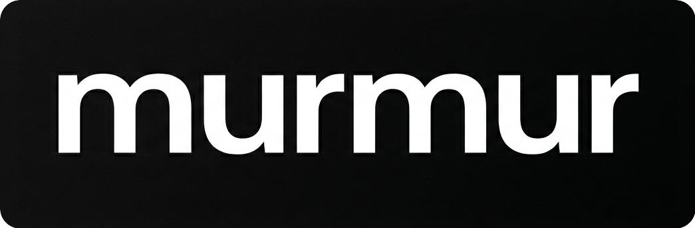
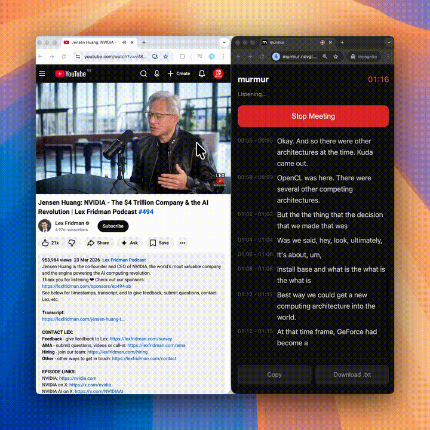

  

  

Meeting recorders charge $10/month. This one is free. Forever.
 No installation. No backend. No API costs. No data leaving your computer.
 Just open <a href="https://murmur.ncvgl.com">murmur.ncvgl.com</a> on Chrome and click Start. Works on Zoom, Meet, Teams - anything.

### How it works

Moonshine v1, a state-of-the-art speech model from ex-Googlers, runs locally in your browser.
  It listens to your mic + speakers. Transcribes everything in real-time. Runs without internet.

### Why this matters

Companies charge up to $30/month for meeting transcription services.
  This costs $0 because there's no server. The AI runs on YOUR laptop using WebGPU.

### The tradeoff

90% accuracy. English only. No speaker labelling. 
 But honestly? ChatGPT doesn’t need a perfect transcript to generate an accurate meeting summary.
